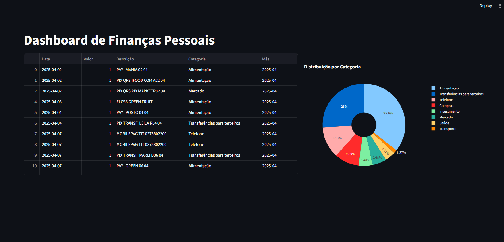

# 💸 Dashboard de Finanças Pessoais



Este projeto tem como objetivo facilitar o controle e visualização de gastos pessoais a partir de extratos bancários. Ele utiliza inteligência artificial 🤖 para classificar automaticamente os lançamentos financeiros e oferece uma interface interativa para análise dos dados 📊.

## ✨ Funcionalidades

- 🔄 **Conversão automática de extratos OFX para CSV** com categorização por IA
- 📈 **Dashboard interativo** para análise dos gastos por categoria e período
- 🎯 **Filtros dinâmicos** por mês e por categoria
- 🧮 Visualização de dados em **tabelas** e **gráficos interativos**

## 🛠️ Tecnologias Utilizadas

- [Python 3.8+](https://www.python.org/) 🐍
- [Streamlit](https://streamlit.io/) (interface do dashboard) 🚦
- [Plotly](https://plotly.com/python/) (gráficos) 📊
- [Pandas](https://pandas.pydata.org/) (manipulação dos dados) 🐼
- [ofxparse](https://ofxparse.readthedocs.io/) (leitura de extratos OFX) 🏦
- [Langchain](https://python.langchain.com/) + [Groq/OpenAI](https://groq.com/) (categorização via LLM) 🧠
- [dotenv](https://pypi.org/project/python-dotenv/) (variáveis de ambiente) 🔑

## 🚀 Como Usar

### 1. Clone o repositório

```bash
git clone https://github.com/yagosamu/analisador_financas.git
cd analisar_financas
```

### 2. Instale as dependências

```bash
pip install -r requirements.txt
```

### 3. Configure as chaves de API

Crie um arquivo `.env` na raiz do projeto e adicione sua chave de API do Groq ou OpenAI, conforme necessidade do Langchain.

### 4. Adicione seus extratos

Coloque seus arquivos `.ofx` na pasta `extratos/`. O script irá processar todos os arquivos dessa pasta.

### 5. Gere o arquivo `finances.csv`

Execute o script de processamento:

```bash
python llm_finance.py
```

Ao final, será criado o arquivo `finances.csv` com os dados categorizados.

### 6. Rode o dashboard

```bash
streamlit run dash.py
```

Acesse a URL fornecida pelo Streamlit para visualizar seu dashboard.

## 📁 Estrutura dos Principais Arquivos

- `llm_finance.py`: Processa extratos OFX, aplica categorização automática e gera o CSV.
- `dash.py`: Interface Streamlit para visualização dos dados.
- `finances.csv`: Arquivo gerado com os dados prontos para análise.
- `extratos/`: Pasta onde os arquivos OFX devem ser colocados.

## 🤝 Como Contribuir

Pull requests são bem-vindos! Para grandes mudanças, abra uma issue primeiro para discutir o que gostaria de modificar.

## 📝 Licença

[MIT](LICENSE)

---

Desenvolvido por [yagosamu](https://github.com/yagosamu) 🚀

